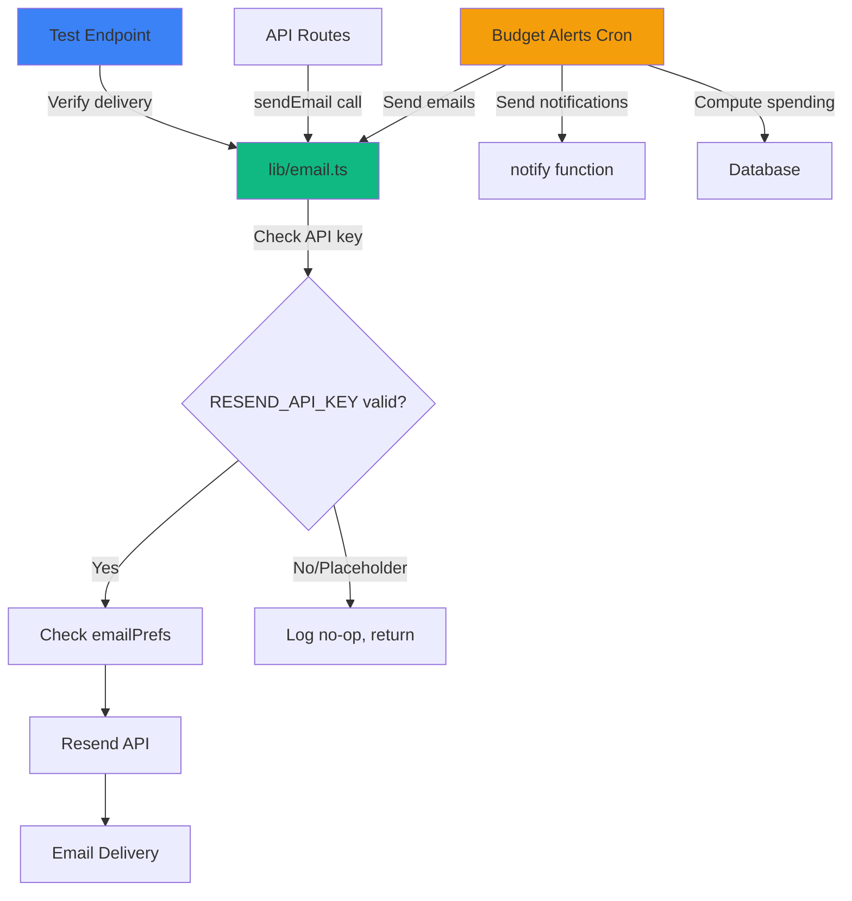
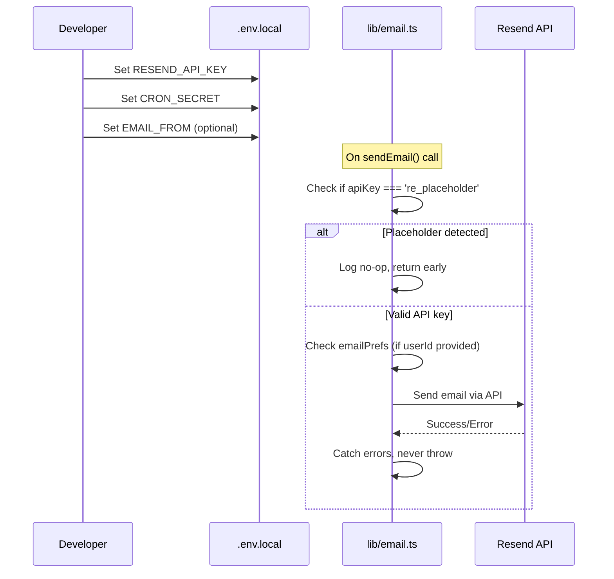
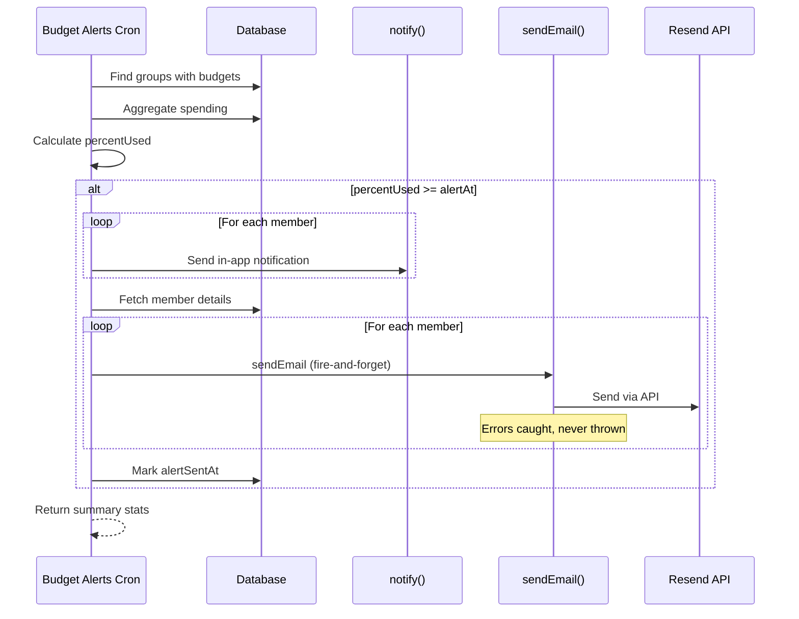

# Design Document: Email System Unblock

## Overview

The SplitEasy email system is fully implemented with 17 email triggers and templates but completely non-functional due to placeholder configuration values. This design document outlines the technical approach to unblock the existing email infrastructure by replacing placeholder values with real credentials, implementing the missing budget alert email functionality, and ensuring production readiness.

### Scope

This design is strictly limited to:
- Configuration changes to enable the existing email system
- Creation of the single missing email template (BudgetAlertEmail)
- Integration of email sending into the budget alerts cron job
- Creation of a temporary test endpoint for verification

**Out of Scope:**
- Modifications to existing email triggers or templates
- Changes to email business logic or user preference handling
- Modifications to the core `sendEmail()` function signature

### Design Goals

1. **Minimal Changes**: Leverage existing infrastructure without modifications
2. **Fire-and-Forget Pattern**: Preserve the pattern where email failures never crash operations
3. **Production Ready**: Ensure all configuration is documented and deployable
4. **Testable**: Provide a mechanism to verify email delivery before production deployment

## Architecture

### System Components



### Current State Analysis

**Existing Infrastructure:**
- ✅ Resend SDK installed and configured (`resend` v6.12.2)
- ✅ Email utility function implemented in `lib/email.ts`
- ✅ 16 email templates created as React components
- ✅ 17 email trigger points implemented across API routes
- ✅ Fire-and-forget pattern correctly used
- ✅ Email preference opt-out logic implemented
- ✅ No-op guard prevents crashes when unconfigured

**Blockers:**
- ❌ `RESEND_API_KEY=re_placeholder` (triggers no-op guard)
- ❌ `CRON_SECRET=your_cron_secret_here` (placeholder value)
- ❌ Budget alert email template missing
- ❌ Budget alerts cron job only sends in-app notifications, no emails

### Configuration Flow



## Components and Interfaces

### 1. Environment Configuration

#### .env.local Changes

**Current State:**
```bash
RESEND_API_KEY=re_placeholder
CRON_SECRET=your_cron_secret_here
EMAIL_FROM=SplitEasy <noreply@spliteasy.app>
SUPPORT_EMAIL=support@spliteasy.app
NEXT_PUBLIC_APP_URL=http://localhost:3000
```

**Required Changes:**
```bash
# Replace with real API key from resend.com
RESEND_API_KEY=re_xxxxxxxxxxxxxxxxxxxxxxxxxxxxxxxxxx

# Generate secure random secret (e.g., openssl rand -hex 32)
CRON_SECRET=<64-character-hex-string>

# Optional: Use Resend test domain for development
EMAIL_FROM=SplitEasy <onboarding@resend.dev>

# Keep existing values
SUPPORT_EMAIL=support@spliteasy.app
NEXT_PUBLIC_APP_URL=http://localhost:3000
```

#### No-op Guard Verification

The existing no-op guard in `lib/email.ts` already implements the correct logic:

```typescript
const apiKey = process.env.RESEND_API_KEY;
if (!apiKey || apiKey === 're_placeholder') {
  console.log('[email] No-op (RESEND_API_KEY not configured):', {
    to: params.to,
    subject: params.subject,
    template: params.react?.type?.toString?.() ?? 'unknown',
  });
  return;
}
```

**Design Decision:** No changes needed to the no-op guard. It correctly:
- Checks for exact string match `'re_placeholder'`
- Logs the no-op for debugging
- Returns early without throwing
- Only blocks the specific placeholder value

#### EMAIL_FROM Fallback

The existing fallback mechanism in `lib/email.ts` already implements the correct logic:

```typescript
const from = process.env.EMAIL_FROM ?? 'SplitEasy <noreply@spliteasy.app>';
```

**Design Decision:** No changes needed. The fallback provides a sensible default, though the domain `spliteasy.app` would need to be verified in Resend for production use. For development, we recommend using Resend's test domain `onboarding@resend.dev`.

### 2. BudgetAlertEmail Template

#### Component Structure

**File:** `emails/BudgetAlertEmail.tsx`

**Props Interface:**
```typescript
interface BudgetAlertEmailProps {
  name: string;                    // Member name
  groupName: string;               // Group name
  groupUrl: string;                // Link to group page
  currentSpentCents: number;       // Current spending in cents
  budgetLimitCents: number;        // Budget limit in cents
  percentUsed: number;             // Percentage of budget used (0-100+)
  currency: string;                // Currency code (USD, INR, etc.)
  isOverBudget: boolean;           // true if percentUsed >= 100
}
```

#### Visual Design States

**State 1: Approaching Budget (percentUsed >= alertAt && percentUsed < 100)**
- Warning tone (amber/yellow color scheme)
- Message: "Your group is approaching its budget limit"
- Progress bar showing percentage used
- Call-to-action: "View Group"

**State 2: Over Budget (percentUsed >= 100)**
- Alert tone (red color scheme)
- Message: "Your group has exceeded its budget limit"
- Progress bar at 100% (or showing overflow)
- Call-to-action: "View Group"

#### Progress Bar Implementation

```typescript
// Progress bar visual representation
const progressBarWidth = Math.min(percentUsed, 100); // Cap at 100% for visual
const progressBarColor = isOverBudget ? '#EF4444' : '#F59E0B'; // Red or amber
```

**Design Pattern:**
- Use a container div with background color for the track
- Use an inner div with dynamic width for the progress
- Show percentage text overlaid or adjacent to the bar

#### Integration with EmailLayout

The template will use the shared `EmailLayout` component for consistent styling:

```typescript
import { EmailLayout } from "./components/EmailLayout";

export function BudgetAlertEmail(props: BudgetAlertEmailProps) {
  return (
    <EmailLayout previewText={`Budget alert for ${props.groupName}`}>
      {/* Email content */}
    </EmailLayout>
  );
}
```

#### Color Scheme (matching existing templates)

- Background: `#0F172A` (dark slate)
- Primary text: `#F1F5F9` (light slate)
- Secondary text: `#94A3B8` (slate)
- Accent (green): `#10B981` (emerald)
- Warning (amber): `#F59E0B`
- Alert (red): `#EF4444`
- Muted text: `#64748B`

#### Data Formatting

Use the existing `formatMoney` utility from `lib/money-utils.ts`:

```typescript
import { formatMoney } from '@/lib/money-utils';

const formattedSpent = formatMoney(currentSpentCents, currency);
const formattedLimit = formatMoney(budgetLimitCents, currency);
```

### 3. Budget Alert Cron Job Integration

#### Current Implementation Analysis

**File:** `app/api/cron/budget-alerts/route.ts`

**Current Flow:**
1. Authenticate request via `CRON_SECRET`
2. Query groups with budgets and `alertSentAt: null`
3. Aggregate spending from expenses
4. Calculate percentage used
5. If `spentPercent >= alertAt`:
   - Send in-app notification via `notify()`
   - Mark alert as sent
6. Return summary statistics

**Missing:** Email sending step

#### Integration Design

**Modification Location:** After the `notify()` loop, before marking alert as sent

```typescript
// Existing code: Send in-app notifications
for (const member of group.members) {
  await notify({
    userId: String(member.user),
    type: "budget_alert",
    title: "Budget alert",
    body: `Your group "${group.name}" has reached ${Math.round(spentPercent)}% of its budget limit.`,
    groupId: String(group._id),
  });
}

// NEW: Send budget alert emails (fire-and-forget)
// Import at top of file:
// import { sendEmail } from '@/lib/email';
// import BudgetAlertEmail from '@/emails/BudgetAlertEmail';
// import User from '@/lib/models/User';

// Fetch member details for email sending
const memberIds = group.members.map(m => m.user);
const members = await User.find({ _id: { $in: memberIds } })
  .select('_id name email')
  .lean();

for (const member of members) {
  const groupUrl = `${process.env.NEXT_PUBLIC_APP_URL}/groups/${group._id}`;
  const isOverBudget = spentPercent >= 100;
  
  // Fire-and-forget email send
  void sendEmail({
    to: member.email,
    subject: isOverBudget 
      ? `Budget Alert: ${group.name} is over budget`
      : `Budget Alert: ${group.name} is approaching its budget`,
    react: BudgetAlertEmail({
      name: member.name,
      groupName: group.name,
      groupUrl,
      currentSpentCents: totalSpentCents,
      budgetLimitCents: group.budget.limitCents,
      percentUsed: spentPercent,
      currency: group.currency ?? 'USD',
      isOverBudget,
    }),
    // Note: No userId/prefsKey - budget alerts bypass opt-out
  });
}

// Existing code: Mark alert as sent
await Group.findByIdAndUpdate(group._id, {
  "budget.alertSentAt": new Date(),
});
```

#### Error Handling Strategy

**Pattern:** Fire-and-forget with try/catch around the email loop

```typescript
// Wrap email sending in try/catch to prevent email failures from crashing cron
try {
  const memberIds = group.members.map(m => m.user);
  const members = await User.find({ _id: { $in: memberIds } })
    .select('_id name email')
    .lean();

  for (const member of members) {
    // ... email sending code ...
  }
} catch (emailError) {
  // Log error but continue processing
  console.error('[cron/budget-alerts] Email sending failed:', emailError, {
    groupId: group._id,
    groupName: group.name,
  });
  // Don't increment errors counter - email failure shouldn't affect alert status
}
```

**Design Rationale:**
- Email failures should not prevent marking the alert as sent
- Email failures should not prevent processing other groups
- The `sendEmail()` function already catches and logs Resend API errors
- The outer try/catch protects against database query failures when fetching members

#### Data Flow



#### Currency Handling

The budget alert email needs to display currency correctly. The group model should have a `currency` field:

```typescript
currency: group.currency ?? 'USD'  // Fallback to USD if not set
```

**Design Decision:** Use the group's currency if available, otherwise default to USD. The `formatMoney` utility already handles multiple currencies (USD, INR, TZS, KES, GBP, EUR).

### 4. Test Endpoint Design

#### API Route Structure

**File:** `app/api/test-email/route.ts`

**Purpose:** Temporary endpoint for verifying email delivery during development

**HTTP Method:** GET (for easy browser testing) or POST (for programmatic testing)

#### Request Parameters

**Query Parameters (GET):**
- `to`: Recipient email address (required)
- `template`: Template to test (optional, defaults to 'welcome')

**Request Body (POST):**
```typescript
{
  to: string;           // Required
  template?: string;    // Optional, defaults to 'welcome'
}
```

#### Response Format

**Success Response (200):**
```typescript
{
  success: true,
  emailId: string,      // Resend email ID
  to: string,
  template: string,
  message: "Test email sent successfully"
}
```

**Error Response (400/500):**
```typescript
{
  success: false,
  error: string,
  details?: string
}
```

#### Development-Only Guard

```typescript
export async function GET(request: NextRequest) {
  // Only allow in development
  if (process.env.NODE_ENV === 'production') {
    return NextResponse.json(
      { error: 'Test endpoint disabled in production' },
      { status: 403 }
    );
  }
  
  // ... rest of implementation
}
```

**Design Rationale:**
- Prevents accidental email sending in production
- Simple check based on NODE_ENV
- Returns 403 Forbidden with clear error message

#### Implementation Approach

```typescript
import { NextRequest, NextResponse } from 'next/server';
import { sendEmail } from '@/lib/email';
import WelcomeEmail from '@/emails/WelcomeEmail';
import BudgetAlertEmail from '@/emails/BudgetAlertEmail';

export async function GET(request: NextRequest) {
  // Development-only guard
  if (process.env.NODE_ENV === 'production') {
    return NextResponse.json(
      { error: 'Test endpoint disabled in production' },
      { status: 403 }
    );
  }

  // Parse query parameters
  const searchParams = request.nextUrl.searchParams;
  const to = searchParams.get('to');
  const template = searchParams.get('template') ?? 'welcome';

  // Validate recipient
  if (!to) {
    return NextResponse.json(
      { error: 'Missing required parameter: to' },
      { status: 400 }
    );
  }

  // Email validation (basic)
  if (!to.includes('@')) {
    return NextResponse.json(
      { error: 'Invalid email address' },
      { status: 400 }
    );
  }

  try {
    // Select template
    let emailComponent;
    let subject;
    
    switch (template) {
      case 'welcome':
        emailComponent = WelcomeEmail({
          name: 'Test User',
          dashboardUrl: process.env.NEXT_PUBLIC_APP_URL ?? 'http://localhost:3000',
        });
        subject = 'Welcome to SplitEasy! (Test)';
        break;
        
      case 'budget-alert':
        emailComponent = BudgetAlertEmail({
          name: 'Test User',
          groupName: 'Test Group',
          groupUrl: `${process.env.NEXT_PUBLIC_APP_URL}/groups/test`,
          currentSpentCents: 85000,  // $850.00
          budgetLimitCents: 100000,  // $1,000.00
          percentUsed: 85,
          currency: 'USD',
          isOverBudget: false,
        });
        subject = 'Budget Alert: Test Group is approaching its budget (Test)';
        break;
        
      default:
        return NextResponse.json(
          { error: `Unknown template: ${template}` },
          { status: 400 }
        );
    }

    // Send email
    await sendEmail({
      to,
      subject,
      react: emailComponent,
    });

    return NextResponse.json({
      success: true,
      to,
      template,
      message: 'Test email sent successfully',
    });
  } catch (error) {
    console.error('[test-email] Error:', error);
    return NextResponse.json(
      {
        success: false,
        error: 'Failed to send test email',
        details: error instanceof Error ? error.message : 'Unknown error',
      },
      { status: 500 }
    );
  }
}
```

#### Usage Examples

**Browser Testing:**
```
http://localhost:3000/api/test-email?to=your-email@example.com
http://localhost:3000/api/test-email?to=your-email@example.com&template=budget-alert
```

**cURL Testing:**
```bash
curl "http://localhost:3000/api/test-email?to=your-email@example.com"
curl "http://localhost:3000/api/test-email?to=your-email@example.com&template=budget-alert"
```

**Design Decision:** Use GET for simplicity during development. The endpoint is temporary and will be removed after verification, so we prioritize ease of use over REST best practices.

## Data Models

### Group Model (Existing)

The budget alert functionality relies on the existing Group model structure:

```typescript
interface Group {
  _id: ObjectId;
  name: string;
  currency?: string;  // Optional, defaults to USD
  members: Array<{
    user: ObjectId;
    // ... other member fields
  }>;
  budget?: {
    limitCents: number;
    alertAt: number;        // Percentage threshold (e.g., 80)
    period: 'monthly' | 'per-trip' | 'total';
    alertSentAt: Date | null;
  };
  // ... other group fields
}
```

**No changes needed** - the existing model already supports all required fields.

### User Model (Existing)

Email sending requires user email addresses:

```typescript
interface User {
  _id: ObjectId;
  name: string;
  email: string;
  emailPrefs?: {
    newLogin?: boolean;
    groupInvite?: boolean;
    inviteExpiringSoon?: boolean;
    expenseVoided?: boolean;
    settlementVoided?: boolean;
    removedFromGroup?: boolean;
    groupDeleted?: boolean;
  };
  // ... other user fields
}
```

**No changes needed** - budget alerts intentionally bypass `emailPrefs` checking.

### Expense Model (Existing)

Budget calculation aggregates expenses:

```typescript
interface Expense {
  _id: ObjectId;
  group: ObjectId;
  amount: number;  // In cents
  isVoided: boolean;
  // ... other expense fields
}
```

**No changes needed** - the existing aggregation query is correct.

## Error Handling

### Fire-and-Forget Pattern Preservation

The existing email system correctly implements the fire-and-forget pattern at multiple levels:

#### Level 1: sendEmail() Function

```typescript
export async function sendEmail(params: SendEmailParams): Promise<void> {
  // ... validation and checks ...
  
  try {
    const resend = new Resend(apiKey);
    await resend.emails.send({
      from,
      to: params.to,
      subject: params.subject,
      react: params.react,
    });
  } catch (err) {
    console.error('[email] Send failed:', err, { to: params.to, subject: params.subject });
    // Swallow — never propagate
  }
}
```

**Design Decision:** No changes needed. The function already catches all errors and never throws.

#### Level 2: Caller Sites

Most existing trigger points use `void` keyword:

```typescript
void sendEmail({
  to: user.email,
  subject: 'Welcome to SplitEasy!',
  react: WelcomeEmail({ name: user.name, dashboardUrl }),
});
```

**Design Decision:** Budget alert emails will follow the same pattern with `void` keyword.

#### Level 3: Budget Alerts Cron Job

Additional try/catch around the email sending loop:

```typescript
try {
  // Fetch members and send emails
  const members = await User.find(...);
  for (const member of members) {
    void sendEmail({ ... });
  }
} catch (emailError) {
  console.error('[cron/budget-alerts] Email sending failed:', emailError);
  // Continue processing - don't affect alert status
}
```

**Design Rationale:**
- Protects against database query failures
- Prevents email failures from affecting alert status
- Allows cron job to continue processing other groups

### Logging Strategy

#### Email Failures

The existing `sendEmail()` function logs failures:

```typescript
console.error('[email] Send failed:', err, { to: params.to, subject: params.subject });
```

**Design Decision:** No changes needed. Logs include:
- Error object
- Recipient email
- Email subject
- Automatic timestamp from console

#### No-op Guard

The existing no-op guard logs when emails are skipped:

```typescript
console.log('[email] No-op (RESEND_API_KEY not configured):', {
  to: params.to,
  subject: params.subject,
  template: params.react?.type?.toString?.() ?? 'unknown',
});
```

**Design Decision:** No changes needed. Helps debug configuration issues during development.

#### Budget Alerts Cron

Add logging for email sending phase:

```typescript
console.log('[cron/budget-alerts] Sending emails to', members.length, 'members for group:', group.name);

// After email loop
console.log('[cron/budget-alerts] Emails sent for group:', group.name);
```

**Design Rationale:** Provides visibility into email sending without excessive logging.

### Graceful Degradation

#### When Resend API Fails

The `sendEmail()` function catches all Resend API errors:

```typescript
try {
  await resend.emails.send({ ... });
} catch (err) {
  console.error('[email] Send failed:', err);
  // Swallow — never propagate
}
```

**Behavior:**
- Error is logged
- Function returns normally
- Caller continues execution
- No user-facing error

**Design Decision:** This is the correct behavior. Email delivery is a best-effort service and should never crash the application.

#### When Database Query Fails

The budget alerts cron job wraps email sending in try/catch:

```typescript
try {
  const members = await User.find({ ... });
  // ... send emails ...
} catch (emailError) {
  console.error('[cron/budget-alerts] Email sending failed:', emailError);
  // Continue - don't affect alert status
}
```

**Behavior:**
- Error is logged
- Alert is still marked as sent (in-app notifications succeeded)
- Cron job continues processing other groups

**Design Rationale:** In-app notifications are the primary notification mechanism. Email is supplementary. If email fails but in-app notifications succeed, the alert should still be marked as sent to prevent duplicate notifications.

## Testing Strategy

### Unit Tests

#### Email Template Rendering

Test that BudgetAlertEmail renders correctly with various inputs:

```typescript
describe('BudgetAlertEmail', () => {
  it('renders approaching budget state correctly', () => {
    const html = render(BudgetAlertEmail({
      name: 'John Doe',
      groupName: 'Roommates',
      groupUrl: 'http://localhost:3000/groups/123',
      currentSpentCents: 85000,
      budgetLimitCents: 100000,
      percentUsed: 85,
      currency: 'USD',
      isOverBudget: false,
    }));
    
    expect(html).toContain('approaching');
    expect(html).toContain('$850.00');
    expect(html).toContain('$1,000.00');
    expect(html).toContain('85%');
  });

  it('renders over budget state correctly', () => {
    const html = render(BudgetAlertEmail({
      name: 'John Doe',
      groupName: 'Roommates',
      groupUrl: 'http://localhost:3000/groups/123',
      currentSpentCents: 110000,
      budgetLimitCents: 100000,
      percentUsed: 110,
      currency: 'USD',
      isOverBudget: true,
    }));
    
    expect(html).toContain('exceeded');
    expect(html).toContain('$1,100.00');
    expect(html).toContain('$1,000.00');
  });
});
```

#### formatMoney Integration

Test that currency formatting works correctly:

```typescript
describe('BudgetAlertEmail currency formatting', () => {
  it('formats USD correctly', () => {
    const html = render(BudgetAlertEmail({
      // ... props with currency: 'USD'
      currentSpentCents: 123456,
    }));
    
    expect(html).toContain('$1,234.56');
  });

  it('formats INR correctly', () => {
    const html = render(BudgetAlertEmail({
      // ... props with currency: 'INR'
      currentSpentCents: 123456,
    }));
    
    expect(html).toContain('₹1,234.56');
  });
});
```

### Integration Tests

#### Test Endpoint Verification

Manual testing using the test endpoint:

1. **Setup:**
   - Set `RESEND_API_KEY` to real API key
   - Ensure `NODE_ENV !== 'production'`

2. **Test Cases:**
   - Send welcome email: `GET /api/test-email?to=your-email@example.com`
   - Send budget alert email: `GET /api/test-email?to=your-email@example.com&template=budget-alert`
   - Verify emails arrive in inbox
   - Verify email rendering is correct
   - Verify links work correctly

3. **Expected Results:**
   - Emails arrive within 1-2 minutes
   - Formatting matches design
   - Links navigate to correct pages
   - Images/styles render correctly

#### Budget Alerts Cron Job

Manual testing of the cron job:

1. **Setup:**
   - Create a test group with budget set
   - Add expenses to reach alert threshold
   - Ensure `alertSentAt` is null

2. **Trigger Cron:**
   ```bash
   curl -H "x-cron-secret: $CRON_SECRET" http://localhost:3000/api/cron/budget-alerts
   ```

3. **Verify:**
   - In-app notification created
   - Email sent to all group members
   - `alertSentAt` updated in database
   - Response shows correct statistics

### Property-Based Testing

**Assessment:** Property-based testing is NOT appropriate for this feature because:

1. **Infrastructure Configuration:** The core changes are environment variable configuration, which is declarative setup, not algorithmic logic
2. **Email Template Rendering:** UI rendering is better tested with snapshot tests
3. **Integration Points:** The feature primarily integrates existing components without new algorithmic logic
4. **Side Effects:** Email sending is a side-effect operation with no return value to assert properties on

**Alternative Testing Strategies:**
- **Snapshot tests** for email template rendering
- **Integration tests** for end-to-end email delivery
- **Manual testing** using the test endpoint
- **Example-based unit tests** for specific scenarios (approaching budget, over budget, different currencies)

### Manual Verification Checklist

Before deploying to production:

- [ ] Resend API key obtained and configured
- [ ] CRON_SECRET generated and configured
- [ ] EMAIL_FROM domain verified in Resend (or using test domain)
- [ ] Test endpoint successfully sends emails
- [ ] Welcome email renders correctly
- [ ] Budget alert email renders correctly (both states)
- [ ] Budget alerts cron job sends emails
- [ ] All 17 existing email triggers tested
- [ ] Email failures don't crash operations
- [ ] Logs show appropriate messages
- [ ] Production environment variables configured in Vercel

## Production Deployment Strategy

### Environment Variable Configuration

#### Vercel Dashboard Setup

1. **Navigate to:** Project Settings → Environment Variables

2. **Add Variables:**

| Variable | Value | Environment |
|----------|-------|-------------|
| `RESEND_API_KEY` | `re_xxxxx...` (from Resend dashboard) | Production, Preview, Development |
| `CRON_SECRET` | Generated via `openssl rand -hex 32` | Production, Preview |
| `EMAIL_FROM` | `SplitEasy <noreply@spliteasy.app>` | Production |
| `EMAIL_FROM` | `SplitEasy <onboarding@resend.dev>` | Preview, Development |
| `SUPPORT_EMAIL` | `support@spliteasy.app` | All |
| `NEXT_PUBLIC_APP_URL` | `https://spliteasy.app` | Production |
| `NEXT_PUBLIC_APP_URL` | `https://preview-url.vercel.app` | Preview |
| `NEXT_PUBLIC_APP_URL` | `http://localhost:3000` | Development |

3. **Redeploy:** Trigger a new deployment to apply environment variables

#### CRON_SECRET Generation

```bash
# Generate a cryptographically secure random secret
openssl rand -hex 32

# Output example:
# 7f3d8e9a2b1c4f6e8d9a3b5c7e1f4a6b8c9d2e5f7a1b3c5d7e9f1a3b5c7d9e1f3
```

**Security Requirements:**
- Minimum 32 characters (64 hex characters = 256 bits)
- Cryptographically secure random generation
- Never commit to version control
- Rotate periodically (e.g., every 90 days)

### Domain Verification Options

#### Option 1: Resend Test Domain (Recommended for Development)

**Domain:** `onboarding@resend.dev`

**Pros:**
- No verification required
- Works immediately
- Free tier sufficient for testing

**Cons:**
- Not suitable for production
- May have deliverability limitations
- Cannot customize sender domain

**Setup:**
```bash
EMAIL_FROM=SplitEasy <onboarding@resend.dev>
```

#### Option 2: Custom Domain (Required for Production)

**Domain:** `spliteasy.app`

**Steps:**
1. Log in to Resend dashboard
2. Navigate to Domains → Add Domain
3. Enter `spliteasy.app`
4. Add DNS records to domain registrar:
   - TXT record for domain verification
   - MX records for email receiving (optional)
   - DKIM records for authentication
5. Wait for verification (usually 5-15 minutes)
6. Configure `EMAIL_FROM`:
   ```bash
   EMAIL_FROM=SplitEasy <noreply@spliteasy.app>
   ```

**DNS Records Example:**
```
Type: TXT
Name: _resend
Value: resend-verification=xxxxx

Type: TXT
Name: resend._domainkey
Value: p=MIGfMA0GCSqGSIb3DQEBAQUAA4GNADCBiQKBgQC...
```

**Verification:**
- Check Resend dashboard for "Verified" status
- Send test email via test endpoint
- Verify email arrives and passes SPF/DKIM checks

### Cron Job Configuration

#### Vercel Cron Setup

The cron job is already configured in `vercel.json`:

```json
{
  "crons": [
    {
      "path": "/api/cron/budget-alerts",
      "schedule": "0 */6 * * *"
    }
  ]
}
```

**Schedule:** Every 6 hours (00:00, 06:00, 12:00, 18:00 UTC)

**Authentication:** The cron job checks `x-cron-secret` header against `CRON_SECRET` environment variable.

**Vercel Configuration:**
1. Cron jobs are automatically enabled for Pro plans
2. Vercel automatically adds the `x-cron-secret` header
3. No additional configuration needed beyond setting `CRON_SECRET`

**Monitoring:**
- Check Vercel deployment logs for cron execution
- Monitor response statistics: `{ processed, alertsSent, errors }`
- Set up alerts for high error rates

### Deployment Checklist

#### Pre-Deployment

- [ ] Obtain Resend API key
- [ ] Generate CRON_SECRET
- [ ] Verify domain in Resend (or plan to use test domain)
- [ ] Test email delivery locally
- [ ] Test budget alerts cron locally
- [ ] Review all environment variables

#### Deployment

- [ ] Configure environment variables in Vercel
- [ ] Deploy to preview environment
- [ ] Test email delivery in preview
- [ ] Test budget alerts cron in preview
- [ ] Verify logs show no errors
- [ ] Deploy to production

#### Post-Deployment

- [ ] Verify production emails are delivered
- [ ] Monitor cron job execution
- [ ] Check error logs
- [ ] Test all 17 email triggers
- [ ] Remove test endpoint (or ensure it's disabled in production)
- [ ] Document any issues or learnings

### Rollback Plan

If email delivery fails in production:

1. **Immediate:** Email failures won't crash the app (fire-and-forget pattern)
2. **Investigation:** Check Vercel logs for error messages
3. **Common Issues:**
   - Invalid API key → Verify `RESEND_API_KEY` in Vercel
   - Domain not verified → Use `onboarding@resend.dev` temporarily
   - Rate limits → Check Resend dashboard for quota
4. **Rollback:** If needed, set `RESEND_API_KEY=re_placeholder` to disable emails
5. **Fix Forward:** Resolve issue and redeploy

### Monitoring and Alerts

#### Metrics to Monitor

- Email send success rate
- Email send failures (from logs)
- Cron job execution frequency
- Cron job error rate
- Budget alert email delivery rate

#### Log Queries

**Vercel Logs:**
```
# Email send failures
[email] Send failed

# No-op guard triggered
[email] No-op (RESEND_API_KEY not configured)

# Budget alerts cron execution
[cron/budget-alerts]

# Budget alerts email sending
[cron/budget-alerts] Sending emails
```

**Resend Dashboard:**
- View email delivery status
- Check bounce/complaint rates
- Monitor API usage and quotas

## Summary

This design document outlines a minimal, focused approach to unblocking the SplitEasy email system:

1. **Configuration Changes:** Replace placeholder values with real credentials
2. **Missing Template:** Create BudgetAlertEmail component following existing patterns
3. **Cron Integration:** Add email sending to budget alerts cron job
4. **Test Endpoint:** Provide temporary verification mechanism
5. **Production Readiness:** Document deployment process and monitoring

**Key Principles:**
- Preserve existing infrastructure and patterns
- Maintain fire-and-forget error handling
- Ensure email failures never crash operations
- Provide clear deployment and verification procedures

**No Changes To:**
- Existing email triggers or templates
- Core `sendEmail()` function
- Email preference checking logic
- Fire-and-forget pattern implementation

The design leverages the existing, well-implemented email infrastructure and adds only the minimal necessary components to make it functional.
