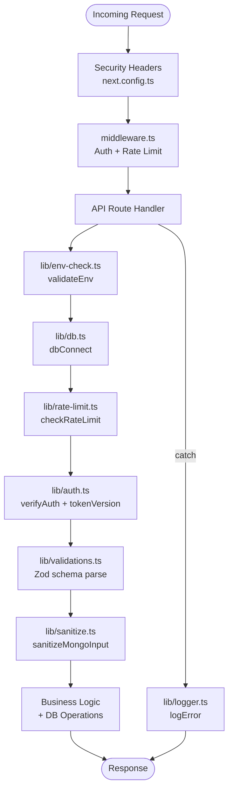

# Design Document: Security Hardening

## Overview

This document describes the technical design for hardening the SplitEasy application's security posture across 12 areas. The work is a purely defensive infrastructure layer — no business logic, frontend components, or monetary calculation code is changed.

The application is a Next.js 14 App Router project using MongoDB/Mongoose, custom JWT auth via the `jose` library (though the current implementation uses `jsonwebtoken`; the hardening will work with the existing `jsonwebtoken`-based `lib/auth.ts`), HTTP-only cookies, and Vercel deployment.

The hardening introduces five new library files, modifies the User model, hardens all mutation API routes, and adds framework-level security headers. All changes are additive or defensive — they tighten existing behavior without altering application semantics.

---

## Architecture

The security hardening is organized as a set of cross-cutting infrastructure modules that are composed into the existing request pipeline:



**Key design decisions:**

- **No new frameworks**: All hardening uses the existing Next.js/Mongoose stack. Zod is added for validation; Upstash Redis is added for distributed rate limiting.
- **Graceful degradation**: Rate limiting falls back to in-memory when Redis is unavailable. Sentry logging falls back to `console.error` when `SENTRY_DSN` is absent.
- **Fail-fast on misconfiguration**: `validateEnv()` is called inside `dbConnect()` so every cold start validates the environment before touching the database.
- **Token invalidation without session store**: `tokenVersion` on the User document provides server-side session invalidation without requiring a Redis session store.

---

## Components and Interfaces

### `lib/env-check.ts` — Environment Variable Validation

```typescript
export function validateEnv(): void
```

Called by `dbConnect()` before every connection attempt. Throws in development/test if required variables are missing; logs to `console.error` in production. Warns (does not throw) for optional Upstash variables.

Required variables checked: `MONGODB_URI` (or `DB_CONNECTION_STRING`), `JWT_SECRET`, `NEXTAUTH_URL`.
Optional variables warned: `UPSTASH_REDIS_REST_URL`, `UPSTASH_REDIS_REST_TOKEN`.

---

### `lib/rate-limit.ts` — Rate Limiting Infrastructure

Primary backend: `@upstash/ratelimit` with `Ratelimit.slidingWindow()`.
Fallback backend: in-memory `Map<string, { count: number; resetAt: number }>`.

```typescript
export type RateLimitPreset = 'auth' | 'mutation' | 'read' | 'upload' | 'invite';

export interface RateLimitResult {
  success: boolean;
  limit: number;
  remaining: number;
  reset: number; // Unix timestamp seconds
}

export async function checkRateLimit(
  request: NextRequest,
  preset: RateLimitPreset
): Promise<RateLimitResult>
```

The function extracts the client IP from `x-forwarded-for` (first value) or `x-real-ip`, falling back to `"unknown"`. The identifier key is `${preset}:${ip}`.

**Preset configuration:**

| Preset     | Limit | Window   |
|------------|-------|----------|
| `auth`     | 5     | 60 s     |
| `mutation` | 30    | 60 s     |
| `read`     | 100   | 60 s     |
| `upload`   | 10    | 60 s     |
| `invite`   | 5     | 3600 s   |

**Response headers set on success:**
- `X-RateLimit-Limit`: the preset limit
- `X-RateLimit-Remaining`: remaining requests in window
- `X-RateLimit-Reset`: Unix timestamp when window resets

**Response on exceeded:** HTTP 429 with `Retry-After: <seconds>` header and JSON body `{ error: "Too many requests", retryAfter: <seconds> }`.

---

### `lib/validations.ts` — Zod Schema Validation

All schemas use `.strict()` to reject extra fields (parameter pollution prevention).

```typescript
export const LoginSchema: z.ZodObject<...>
export const RegisterSchema: z.ZodObject<...>
export const CreateGroupSchema: z.ZodObject<...>
export const UpdateGroupSchema: z.ZodObject<...>
export const CreateExpenseSchema: z.ZodObject<...>   // refinement: sum(splits) === total
export const UpdateExpenseSchema: z.ZodObject<...>
export const CreateSettlementSchema: z.ZodObject<...> // refinement: fromUserId !== toUserId
export const DisputeSettlementSchema: z.ZodObject<...>
export const JoinGroupSchema: z.ZodObject<...>
export const GuestActivateSchema: z.ZodObject<...>
export const UpdateProfileSchema: z.ZodObject<...>
export const ChangePasswordSchema: z.ZodObject<...>
```

**Helper for route handlers:**

```typescript
export function parseBody<T>(
  schema: z.ZodSchema<T>,
  data: unknown
): { success: true; data: T } | { success: false; response: NextResponse }
```

Returns a typed result. On failure, the `response` field is a pre-built HTTP 400 `NextResponse` with the Zod error's `flatten()` output.

**Key schema details:**

- `CreateExpenseSchema`: includes `.refine()` that checks `splits.reduce((s, x) => s + x.amount, 0) === totalAmount`. All amounts are integers (cents).
- `CreateSettlementSchema`: includes `.refine()` that checks `fromUserId !== toUserId`.
- `LoginSchema`: `email` is `.email()`, `password` is `.min(1)`.
- `RegisterSchema`: `password` is `.min(6)`, `name` is `.min(1).max(100)`.

---

### `lib/sanitize.ts` — MongoDB Injection Sanitization

```typescript
export const SAFE_USER_FIELDS: string

export function sanitizeMongoInput<T>(input: T): T

export function sanitizeRegex(input: string): string
```

**`SAFE_USER_FIELDS`**: A space-separated projection string: `"-password -loginAttempts -lockUntil -lastLoginIp"`. Used in all `User.find*()` calls that return data to clients.

**`sanitizeMongoInput`**: Recursively traverses the input. For objects, drops any key that starts with `$` or contains `.`. Arrays are traversed element-by-element. Primitives are returned as-is.

**`sanitizeRegex`**: Escapes the characters `\ ^ $ . | ? * + ( ) [ ] { }` by prepending a backslash. The returned string is safe to pass to `new RegExp()`.

---

### `lib/logger.ts` — Structured Error Logging

```typescript
export function logError(
  context: string,
  error: unknown,
  metadata?: Record<string, unknown>
): void
```

Logs a structured object:
```json
{
  "context": "[login route]",
  "message": "<sanitized error message>",
  "timestamp": "2024-01-01T00:00:00.000Z",
  "metadata": { ... }
}
```

Message extraction: `error instanceof Error ? error.message : String(error)`.

If `SENTRY_DSN` is defined, forwards to Sentry via `Sentry.captureException(error, { extra: { context, ...metadata } })`. Otherwise writes to `console.error`.

The function wraps its entire body in a try/catch and silently suppresses any secondary error.

---

### `lib/models/User.ts` — Model Changes

New fields added to `UserSchema`:

```typescript
loginAttempts: { type: Number, default: 0 }
lockUntil:     { type: Date, default: null }
lastLoginAt:   { type: Date, default: null }
lastLoginIp:   { type: String, default: null }
tokenVersion:  { type: Number, default: 0, required: true }
```

The `IUser` interface is updated to include these fields. `loginAttempts`, `lockUntil`, `lastLoginAt`, and `lastLoginIp` are excluded from client responses via `SAFE_USER_FIELDS`.

---

### `lib/auth.ts` — Auth Token Security Changes

**`signToken`** is updated to accept `tokenVersion` and embed it in the JWT payload:

```typescript
export function signToken(userId: string, tokenVersion: number): string
// payload: { userId, tokenVersion }
```

**`verifyAuth`** is updated to perform a DB lookup after JWT verification:

```typescript
export async function verifyAuth(request?: NextRequest): Promise<string | null>
```

After decoding the JWT, it queries `User.findById(decoded.userId).select('tokenVersion isDisabled')`. If the user is not found, is disabled, or `decoded.tokenVersion !== user.tokenVersion`, it returns `null`.

This adds one DB query per authenticated request. The query is lightweight (single document, two fields, indexed by `_id`).

---

### `middleware.ts` — Middleware Changes

The middleware is extended to cover all API routes (not just `/admin`). It applies rate limiting at the edge for the auth endpoints:

```typescript
export const config = {
  matcher: ['/admin/:path*', '/api/auth/:path*', '/api/upload/:path*'],
};
```

The middleware calls `checkRateLimit` for matched paths and returns 429 early if exceeded, before the request reaches the route handler. For other API routes, rate limiting is applied inside the route handler itself (since the middleware runs in the Edge Runtime and some routes need Node.js APIs).

---

### `next.config.ts` — Security Headers

Security headers are applied via the `headers()` async function:

```typescript
async headers() {
  return [
    {
      source: '/(.*)',
      headers: [
        { key: 'X-Frame-Options', value: 'DENY' },
        { key: 'X-Content-Type-Options', value: 'nosniff' },
        { key: 'Referrer-Policy', value: 'strict-origin-when-cross-origin' },
        { key: 'X-DNS-Prefetch-Control', value: 'off' },
        { key: 'Permissions-Policy', value: 'camera=(), microphone=(), geolocation=()' },
        { key: 'Content-Security-Policy', value: "default-src 'self'; script-src 'self' 'unsafe-inline' 'unsafe-eval'; style-src 'self' 'unsafe-inline'; img-src 'self' data: https://res.cloudinary.com; connect-src 'self'; frame-ancestors 'none'" },
      ],
    },
    {
      source: '/api/(.*)',
      headers: [
        { key: 'Cache-Control', value: 'no-store' },
      ],
    },
  ];
}
```

HSTS is conditionally added only in production (checked via `process.env.NODE_ENV === 'production'` inside the `headers()` function).

---

### `app/api/upload/receipt/route.ts` — File Upload Security

The upload route is created with the following validation pipeline:

1. **MIME type allowlist check**: Reject if `Content-Type` not in `['image/jpeg', 'image/png', 'image/webp', 'image/gif', 'application/pdf']` → HTTP 415.
2. **Size check**: Read the file as a buffer; if `buffer.length > 10_485_760` → HTTP 413.
3. **Magic bytes check**: Read first 8–12 bytes and compare against the signature table → HTTP 415 if mismatch.
4. **Filename sanitization**: Strip `../`, `./`, non-alphanumeric chars except `.`, `-`, `_`; truncate to 255 chars.
5. **Upload to Cloudinary**: Only after all checks pass.

**Magic bytes table:**

```typescript
const MAGIC_BYTES: Record<string, (buf: Buffer) => boolean> = {
  'image/jpeg': (b) => b[0] === 0xFF && b[1] === 0xD8 && b[2] === 0xFF,
  'image/png':  (b) => b[0] === 0x89 && b[1] === 0x50 && b[2] === 0x4E && b[3] === 0x47
                    && b[4] === 0x0D && b[5] === 0x0A && b[6] === 0x1A && b[7] === 0x0A,
  'image/webp': (b) => b[0] === 0x52 && b[1] === 0x49 && b[2] === 0x46 && b[3] === 0x46
                    && b[8] === 0x57 && b[9] === 0x45 && b[10] === 0x42 && b[11] === 0x50,
  'image/gif':  (b) => b[0] === 0x47 && b[1] === 0x49 && b[2] === 0x46 && b[3] === 0x38,
  'application/pdf': (b) => b[0] === 0x25 && b[1] === 0x50 && b[2] === 0x44 && b[3] === 0x46,
};
```

---

### API Route Auth Audit

Every mutation route (POST/PUT/PATCH/DELETE) under `app/api/` must follow this pattern:

```typescript
export async function POST(request: NextRequest) {
  try {
    await dbConnect();
    const userId = await verifyAuth(request);
    if (!userId) return unauthorizedResponse();
    // ... rate limit check ...
    // ... schema validation ...
    // ... business logic ...
  } catch (error) {
    logError('[route context]', error);
    return errorResponse('Generic message', 500);
  }
}
```

**Public exceptions** (no auth required):
- `POST /api/auth/login`
- `POST /api/auth/register`
- `POST /api/guest/activate`
- `GET /api/groups/join/[token]`

All other mutation routes must have `verifyAuth` as the first operation after `dbConnect()`.

---

## Data Models

### User Model — New Fields

| Field           | Type    | Default | Notes                                      |
|-----------------|---------|---------|--------------------------------------------|
| `loginAttempts` | Number  | 0       | Incremented on each failed login           |
| `lockUntil`     | Date    | null    | Set to now+15min when attempts reach 5     |
| `lastLoginAt`   | Date    | null    | Updated on successful login                |
| `lastLoginIp`   | String  | null    | Updated on successful login; excluded from client responses |
| `tokenVersion`  | Number  | 0       | Incremented to invalidate all sessions     |

### JWT Payload — Updated Shape

```typescript
interface JwtPayload {
  userId: string;
  tokenVersion: number;
  iat: number;
  exp: number;
}
```

### Rate Limit In-Memory Store

```typescript
interface InMemoryEntry {
  count: number;
  resetAt: number; // Unix ms
}
// Map<string, InMemoryEntry>  keyed by "${preset}:${ip}"
```

---

## Correctness Properties

*A property is a characteristic or behavior that should hold true across all valid executions of a system — essentially, a formal statement about what the system should do. Properties serve as the bridge between human-readable specifications and machine-verifiable correctness guarantees.*

### Property 1: Invalid request bodies produce structured 400 errors

*For any* request body that fails Zod schema validation (missing required fields, wrong types, or extra fields), the API route SHALL return HTTP 400 with a structured error object containing field-level error details.

**Validates: Requirements 2.3, 2.7**

---

### Property 2: Expense split amounts must sum to total

*For any* `CreateExpenseSchema` input where the sum of all split amounts does not equal the declared total amount, `schema.safeParse()` SHALL return `success: false`.

**Validates: Requirements 2.4**

---

### Property 3: Self-settlement is always rejected

*For any* user ID, `CreateSettlementSchema.safeParse()` with `fromUserId === toUserId` SHALL return `success: false`.

**Validates: Requirements 2.5**

---

### Property 4: Strict mode rejects extra fields on all schemas

*For any* valid input object with one or more additional unexpected keys added, every exported Zod schema's `.safeParse()` SHALL return `success: false`.

**Validates: Requirements 2.7**

---

### Property 5: sanitizeMongoInput removes all operator keys at any depth

*For any* arbitrarily nested object, `sanitizeMongoInput(obj)` SHALL return an object containing no keys that start with `$` and no keys that contain `.`, regardless of nesting depth.

**Validates: Requirements 5.1, 5.4**

---

### Property 6: sanitizeRegex produces regex-safe strings

*For any* string `s`, `new RegExp(sanitizeRegex(s))` SHALL not throw a `SyntaxError`.

**Validates: Requirements 5.2, 5.5**

---

### Property 7: Disallowed MIME types are rejected with HTTP 415

*For any* MIME type string not in the upload allowlist, the upload handler SHALL return HTTP 415.

**Validates: Requirements 6.2**

---

### Property 8: Magic bytes mismatch is rejected with HTTP 415

*For any* file buffer whose leading bytes do not match the magic byte signature for the declared MIME type, the upload handler SHALL return HTTP 415.

**Validates: Requirements 6.3**

---

### Property 9: Oversized files are rejected with HTTP 413

*For any* file buffer whose length exceeds 10,485,760 bytes, the upload handler SHALL return HTTP 413.

**Validates: Requirements 6.4**

---

### Property 10: Filename sanitization removes all dangerous characters

*For any* filename string, `sanitizeFilename(name)` SHALL return a string containing no `../`, `./`, no characters outside `[a-zA-Z0-9._-]`, and with length ≤ 255.

**Validates: Requirements 6.5**

---

### Property 11: API responses never expose sensitive user fields

*For any* user document returned by an API route, the serialized response body SHALL NOT contain the keys `password`, `loginAttempts`, `lockUntil`, or `lastLoginIp`.

**Validates: Requirements 7.4**

---

### Property 12: Failed login increments loginAttempts by exactly 1

*For any* user with `loginAttempts = N`, a failed login attempt (wrong password) SHALL result in `loginAttempts = N + 1` in the database.

**Validates: Requirements 3.2**

---

### Property 13: Locked accounts receive HTTP 429 without password comparison

*For any* user with `lockUntil` set to a future timestamp, a login attempt SHALL return HTTP 429 without invoking `bcrypt.compare`.

**Validates: Requirements 3.4**

---

### Property 14: Successful login resets all lockout fields

*For any* user with `loginAttempts > 0` and/or `lockUntil` set, a successful login SHALL result in `loginAttempts = 0`, `lockUntil = null`, and `lastLoginAt` and `lastLoginIp` set to current values.

**Validates: Requirements 3.6**

---

### Property 15: JWT payload includes current tokenVersion

*For any* user with `tokenVersion = N`, the JWT issued at login SHALL decode to a payload containing `tokenVersion: N`.

**Validates: Requirements 8.2**

---

### Property 16: tokenVersion mismatch invalidates the session

*For any* JWT with `tokenVersion = N` and a user whose current `tokenVersion = M` where `N ≠ M`, `verifyAuth()` SHALL return `null`.

**Validates: Requirements 8.3, 8.4**

---

### Property 17: tokenVersion increments by 1 on invalidating actions

*For any* user with `tokenVersion = N`, after a password change, admin disable, or logout-all action, the user's `tokenVersion` in the database SHALL equal `N + 1`.

**Validates: Requirements 8.5, 8.6, 8.7**

---

### Property 18: validateEnv lists all missing variables in the thrown error

*For any* non-empty subset of required environment variables that are absent, `validateEnv()` (in development/test mode) SHALL throw an `Error` whose message contains the name of every missing variable.

**Validates: Requirements 9.2**

---

### Property 19: Unauthenticated requests to mutation routes receive HTTP 401

*For any* mutation route (excluding public exceptions) and *for any* request body, a request with no valid auth cookie SHALL receive HTTP 401 before any database write operation is performed.

**Validates: Requirements 10.1, 10.2, 10.4**

---

### Property 20: logError always produces a structured log with required fields

*For any* context string, error value, and optional metadata, `logError()` SHALL produce a log entry containing `context`, `message`, and `timestamp` fields, and SHALL NOT throw.

**Validates: Requirements 11.2, 11.5**

---

## Error Handling

### Layered Error Strategy

```
Route Handler catch block
  └─ logError('[route context]', error, { userId, ... })
       └─ if SENTRY_DSN → Sentry.captureException
          else → console.error(structured object)
  └─ return errorResponse('Generic message', 500)
       (never exposes error.message to client)
```

### Specific Error Cases

| Scenario | HTTP Status | Response Body |
|---|---|---|
| Rate limit exceeded | 429 | `{ error: "Too many requests", retryAfter: N }` |
| Schema validation failure | 400 | `{ error: "Validation failed", details: { fieldErrors: {...} } }` |
| Unauthenticated request | 401 | `{ success: false, error: "Unauthorized. Please login." }` |
| Account locked (brute force) | 429 | `{ error: "Account locked. Try again in N minutes." }` |
| Invalid MIME type | 415 | `{ error: "Unsupported file type" }` |
| File too large | 413 | `{ error: "File exceeds 10 MiB limit" }` |
| tokenVersion mismatch | 401 | `{ success: false, error: "Unauthorized. Please login." }` |
| Internal server error | 500 | `{ success: false, error: "Generic message" }` (never raw error) |

### Timing Attack Prevention

The login route always performs a bcrypt comparison, even for non-existent emails. A static dummy hash is compared against the submitted password to ensure response time is indistinguishable from a real failed attempt:

```typescript
const DUMMY_HASH = '$2b$10$abcdefghijklmnopqrstuvuuuuuuuuuuuuuuuuuuuuuuuuuuuuuuu';
// Used when user is not found — result is discarded
await bcrypt.compare(password, DUMMY_HASH);
```

---

## Testing Strategy

### Dual Testing Approach

Unit tests cover specific examples, edge cases, and error conditions. Property-based tests verify universal properties across all inputs. Both are necessary for comprehensive coverage.

### Property-Based Testing Library

**Library**: `fast-check` (TypeScript-native, works in Jest/Vitest without additional setup).

Each property test runs a minimum of **100 iterations**. Each test is tagged with a comment referencing the design property:

```typescript
// Feature: security-hardening, Property 5: sanitizeMongoInput removes all operator keys at any depth
```

### Unit Tests

**`lib/env-check.ts`**:
- Missing required vars in dev → throws with all names listed
- Missing required vars in production → logs to console.error, does not throw
- Missing Upstash vars → warns, does not throw
- All vars present → no throw, no warning

**`lib/rate-limit.ts`**:
- Preset configuration values match spec (auth: 5/60s, etc.)
- In-memory fallback activates when Redis env vars are absent
- Exceeded limit → 429 + Retry-After header
- Within limit → X-RateLimit-* headers present

**`lib/validations.ts`**:
- All 12 named exports exist
- LoginSchema rejects missing email/password
- RegisterSchema rejects password < 6 chars
- CreateExpenseSchema rejects splits that don't sum to total
- CreateSettlementSchema rejects fromUserId === toUserId

**`lib/sanitize.ts`**:
- SAFE_USER_FIELDS excludes password, loginAttempts, lockUntil, lastLoginIp
- sanitizeMongoInput removes top-level $ keys
- sanitizeMongoInput removes nested $ keys
- sanitizeMongoInput removes keys containing '.'
- sanitizeRegex escapes all special regex characters

**`lib/logger.ts`**:
- Logs structured object with context, message, timestamp
- Does not throw when logging fails
- Calls Sentry when SENTRY_DSN is set
- Falls back to console.error when SENTRY_DSN is absent

**Login route brute force**:
- loginAttempts increments on failed login
- lockUntil set after 5 failures
- Locked account returns 429 without bcrypt call
- Successful login resets all lockout fields
- Non-existent email performs dummy bcrypt comparison
- Both failure cases return identical error messages

**Auth token security**:
- JWT payload contains tokenVersion
- verifyAuth returns null when tokenVersion mismatches
- tokenVersion increments on password change / disable / logout-all

### Property-Based Tests

Using `fast-check`:

```typescript
import fc from 'fast-check';
```

**Property 1 & 4** — Schema validation:
```typescript
// Arbitrary: generate objects with extra keys added to valid inputs
fc.assert(fc.property(
  fc.record({ /* valid fields */ }).chain(valid =>
    fc.record({ [fc.string()]: fc.anything() }).map(extra => ({ ...valid, ...extra }))
  ),
  (input) => !schema.safeParse(input).success
));
```

**Property 2** — Expense split sum:
```typescript
fc.assert(fc.property(
  fc.array(fc.integer({ min: 1, max: 10000 }), { minLength: 1 }),
  fc.integer({ min: 1, max: 100000 }),
  (splits, total) => {
    const sum = splits.reduce((a, b) => a + b, 0);
    fc.pre(sum !== total);
    return !CreateExpenseSchema.safeParse({ splits: splits.map(a => ({ amount: a })), totalAmount: total }).success;
  }
));
```

**Property 5** — sanitizeMongoInput:
```typescript
// Feature: security-hardening, Property 5: sanitizeMongoInput removes all operator keys at any depth
fc.assert(fc.property(
  fc.object({ key: fc.oneof(fc.string(), fc.string().map(s => '$' + s), fc.string().map(s => s + '.' + s)) }),
  (obj) => {
    const result = sanitizeMongoInput(obj);
    return !hasOperatorKeys(result); // recursive check
  }
));
```

**Property 6** — sanitizeRegex:
```typescript
// Feature: security-hardening, Property 6: sanitizeRegex produces regex-safe strings
fc.assert(fc.property(
  fc.string(),
  (s) => {
    expect(() => new RegExp(sanitizeRegex(s))).not.toThrow();
    return true;
  }
));
```

**Properties 7, 8, 9, 10** — Upload validation:
```typescript
// Property 7: disallowed MIME types
fc.assert(fc.property(
  fc.string().filter(s => !ALLOWED_MIME_TYPES.includes(s)),
  async (mimeType) => {
    const result = await validateUpload({ mimeType, buffer: Buffer.alloc(100) });
    return result.status === 415;
  }
));
```

**Property 19** — Unauthenticated mutation routes:
```typescript
// For each mutation route, test with no auth cookie
for (const route of MUTATION_ROUTES) {
  fc.assert(fc.property(
    fc.object(), // arbitrary request body
    async (body) => {
      const response = await route.handler(makeRequest(body, /* no cookie */));
      return response.status === 401;
    }
  ));
}
```

### Integration Tests

- Security headers present on all responses (smoke test)
- Rate limit headers present on successful requests
- Rate limit 429 after exceeding threshold (using in-memory fallback)
- `dbConnect()` calls `validateEnv()` before connecting
- All `User.find*()` calls in API routes use `SAFE_USER_FIELDS`

### Test Configuration

```typescript
// vitest.config.ts or jest.config.ts
{
  testEnvironment: 'node',
  // fast-check default: 100 runs per property
  // Override per-test: fc.assert(fc.property(...), { numRuns: 1000 })
}
```
